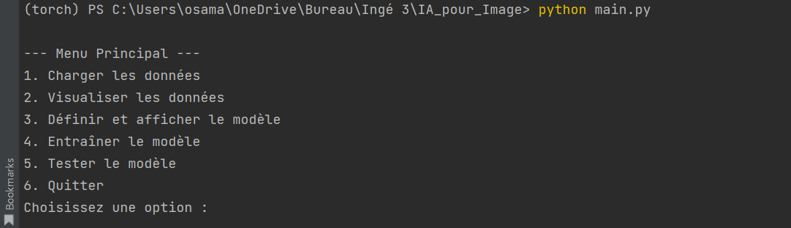
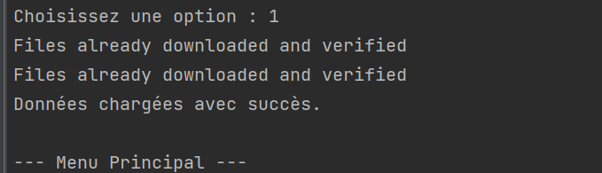
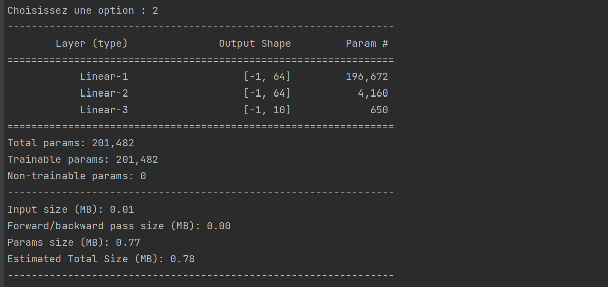
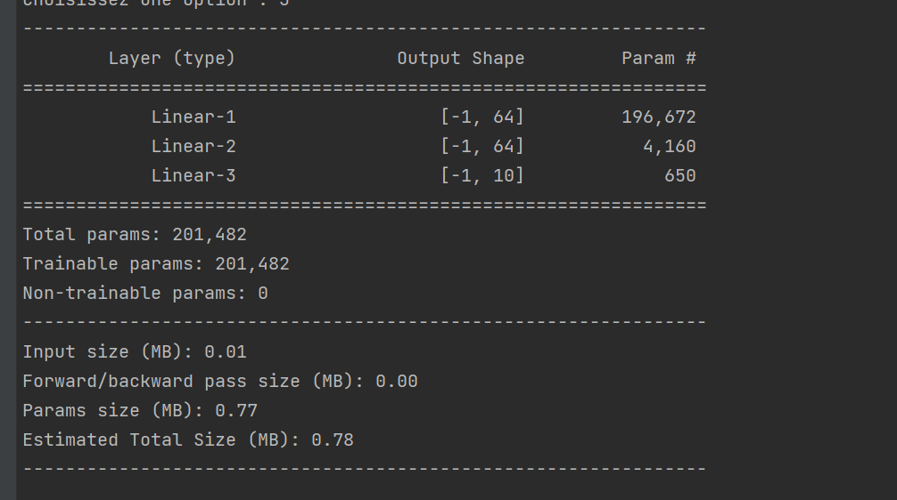

# IA pour Image

Projet de vision par ordinateur en Python utilisant PyTorch. Le tp1 est structuré avec un menu interactif permettant d'exécuter différentes étapes comme le chargement des données, la visualisation, la définition du modèle, l'entraînement et les tests.

---

## **Table des Matières**
1. [Description du Menu Interactif](#description-du-menu-interactif)
2. [Structure des Fichiers](#structure-des-fichiers)
3. [Dépendances](#dépendances)
4. [Fonctionnalités](#fonctionnalités)
   - [Chargement des Données](#chargement-des-données)
   - [Visualisation des Données](#visualisation-des-données)
   - [Définition du Modèle](#définition-du-modèle)
   - [Entraînement du Modèle](#entraînement-du-modèle)
   - [Test du Modèle](#test-du-modèle)
5. [Exécution du Projet](#exécution-du-projet)
6. [Résultats et Visualisation](#résultats-et-visualisation)
---

## **Description du Menu Interactif**

Le projet est piloté par un menu interactif disponible dans `main.py`. Il permet d'exécuter chaque partie du pipeline de manière modulaire.

**Menu :**
```
--- Menu Principal ---
1. Charger les données
2. Visualiser les données
3. Définir et afficher le modèle
4. Entraîner le modèle
5. Tester le modèle
6. Quitter
```
---

## **Structure des Fichiers**

```
vision_project/
│
├── main.py                # Menu interactif
├── requirements.txt       # Dépendances
├── data_loader.py         # Chargement des données
├── visualize.py           # Visualisation des images
├── model.py               # Définition du modèle
├── train.py               # Entraînement du modèle
└── test.py                # Test et évaluation
```

---

## **Dépendances**

Les dépendances nécessaires au projet sont listées dans `requirements.txt`. Pour les installer :
```bash
pip install -r requirements.txt
```

---

## **Fonctionnalités**

### **Chargement des Données**
Le script `data_loader.py` se charge de télécharger et charger le dataset CIFAR-10 en utilisant `torchvision`. Les données sont transformées et normalisées automatiquement.

**Commande :**
```bash
python data_loader.py
```

---

### **Visualisation des Données**
`visualize.py` affiche quelques images du dataset avec leurs étiquettes. La fonction `imshow` est utilisée pour rendre les images lisibles.

**Commande :**
```bash
python visualize.py
```

---

### **Définition du Modèle**
Le fichier `model.py` contient une implémentation simple d'un réseau de neurones MLP (Multilayer Perceptron). La structure est définie avec la bibliothèque `torchsummary` pour afficher un résumé du modèle.

**Commande :**
```bash
python model.py
```

---

### **Entraînement du Modèle**
`train.py` entraîne le modèle sur les données CIFAR-10. L'entraînement se fait sur GPU (`cuda`) si disponible, sinon il utilise le CPU. Le modèle est optimisé avec SGD et une fonction de perte `CrossEntropyLoss`.

**Commande :**
```bash
python train.py
```

---

### **Test du Modèle**
`test.py` évalue le modèle sur les données de test et affiche la précision globale.

**Commande :**
```bash
python test.py
```

---

## **Exécution du Projet**

Pour exécuter l'ensemble du projet avec le menu interactif :
```bash
python main.py
```

---

## **Résultats et Visualisation**

Voici des exemples de visualisation et des résultats obtenus lors de l'entraînement (tu pourras ajouter tes propres images ici) :

**Menu :**


**Menu :**


**Exemple de visualisation des données :**  


**Résumé du modèle :**  

---

                                  
